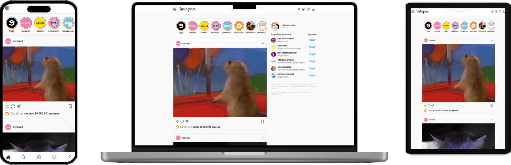

<p align="center">
  <a href="https://raferdev.github.io/instagram-react/">
 </a>
</p>

<h3 align="center">Instagram.com + ReactJS</h3>

<div align="center">

[]()
[](https://github.com//raferdev/instagram-react/issues)
[](https://github.com/raferdev/instagram-react/pulls)
[](/LICENSE)

</div>

---



---
<p align="center"> This is a ReactJSS project based on the website <a href="https://www.instagram.com/">Instagram Site</a> style with focus on training resposive front-end.
</p>

## 📝 Table of Contents

- [About](#about)
- [Getting Started](#getting_started)
- [Usage](#usage)
- [Built Using](#built_using)
- [Authors](#authors)

## 🧐 About <a name = "about"></a>

This project i use to training the ReactJS notation. I had to search by specific tags in html to recreate the original site and css properties to interage with user and organize the front-end. Its responsive layout and can change with 3 types of display widths (bigger than 935px, bigger than 614px and less than 614px).

## 🏁 Getting Started <a name = "getting_started"></a>

You can clone the project and start on your local host or open the site hospeded <a href="https://raferdev.github.io/instagram-react/">here</a>

Clone

 ```
 git clone https://github.com/raferdev/instagram-react
 ```

## 🎈 Usage <a name="usage"></a>
You can right click and go to option inspect on your browser to use the options sizes of display and see the responsive layout

## ⛏️ Built Using <a name = "built_using"></a>

- [HTML](https://developer.mozilla.org/pt-BR/docs/Web/HTML) - Markup Language
- [CSS](https://developer.mozilla.org/pt-BR/docs/Web/CSS) - Style Language
- [JS](https://developer.mozilla.org/pt-BR/docs/Web/javascript) - Interative Language
- [ReactJS](https://pt-br.reactjs.org/) - Javascript Super Library

## ✍️ Authors <a name = "authors"></a>

- [@rafaelfernandev](https://github.com/raferdev) - Idea & Initial work
